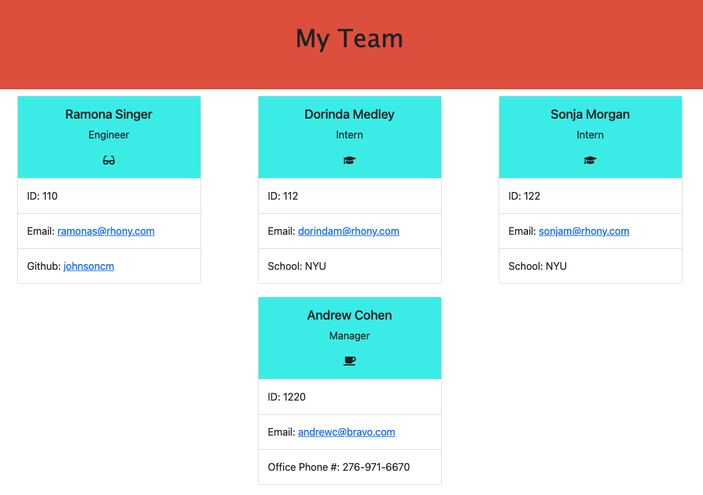
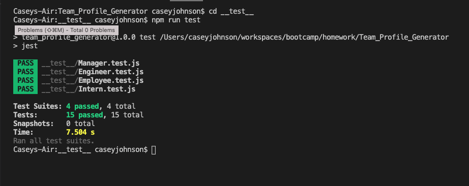
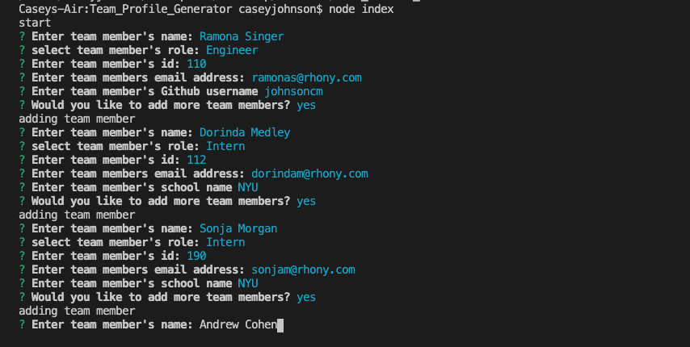

# Team_Profile_Generator

## Description

## Table of Contents
[Technologies Used](#Technologies-Used) 
[Installation](#Installation) 
[User Story](#User-Story) 
[Acceptance Criteria](#Acceptance-Criteria) 
[Testing](#Testing) 
[Images](#Images) 
[Demo](#Demo) 
[Contact](#Contact) 

## Technologies Used
        Javascript
        Node.js
        Inquirer
        Jest
        HTML
        CSS

## Installation

    To install dependencies: Run npm i
    To run Team Profile Generator application: Run node index and 

## User Story    
    AS A manager
    I WANT to generate a webpage that displays my team's basic info
    SO THAT I have quick access to their emails and Github profiles

## Accecptance Criteria
    GIVEN a command-line application that accepts user input
    WHEN I am prompted for my team members and their information
    THEN an HTML file is generated that displays a nicely formatted team roster based on user input
    WHEN I click on an email address in the HTML
    THEN my default email program opens and populates the TO field of the email with the address
    WHEN I click on the Github username
    THEN that Github profile opens in a new tab
    WHEN I start the application
    THEN I am prompted to enter the team manager's name, employee ID, email address
    WHEN I enter the team manager's name, employee ID, email address and office number
    THEN I am asked if I would like to add another team member
    WHEN I decide to finish building my team
    THEN I exit the application and the HTML is generated

## Testing

        npm run test

## Images

## Demo

[Link to Video Demo](https://drive.google.com/file/d/104mIjCfjrItyHMCc-p1ILFkLdlIZft8J/view)

## Contact

Please contact me at johnsoncm3@gmail.com or visit [johnsoncm](https://www.github.com/johnsoncm) for any questions or comments.